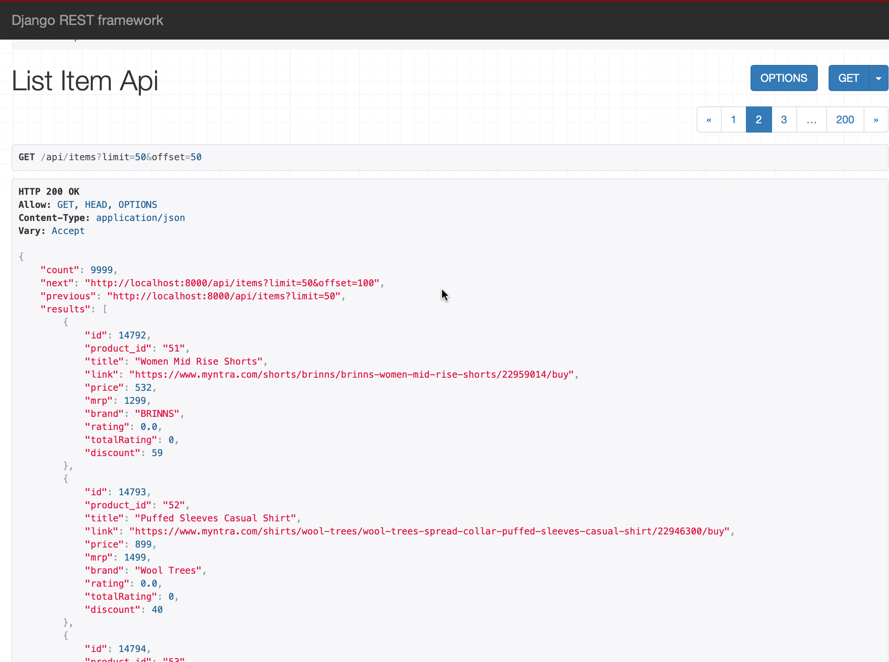

# Ecommerce API created using Myntra dataset

This is an Ecommerce API which I created using a dataset with data taken from https://myntra.com which is one of the most popular online clothing stores in India.

http://localhost:8000/api-docs/

The API docs can be viewed using the above link. Swagger is used to generate API docs under the hood using a package called 'drf_spectacular'.

## Getting Started

* Create a new virtual environment and install packages specified in the requirements.txt file.

* Hook in your database of choice, make necessary database changes in the settings.py file inside the project folder. Obviously, some familiarity with Django folder structures is required for this. By default this project uses MySQL as database.

* Make migrations when you're done with the database settings and migrate.
* Run python manage.py runserver, and the application should be running on port 8000 by default.

## Built With

* [Python Django](https://www.djangoproject.com/)
* [Django Rest Framework](https://www.django-rest-framework.org/)
* [Swagger Docs](https://swagger.io/)

## Features 

Application has around 10K entries for clothing related products coming from a dataset I retrieved from Kaggle.com
For feeding the data into the database, Management commands are used.

```
python manage.py populate
python manage.py clear
```

Populate command reads the csv file and creates an item model for each row saving it in the database. Clear command is as the name suggests clears the database in case required in any case.

The initial data was kind of large so I had to condense it by only picking the first 10k entries from the csv file. It was done using the pandas library.

```
import pandas as pd

def condense_data():

    # Read data from csv file
    df = pd.read_csv('data/myntra.csv')

    # Read only first 5k enties and save it in a new csv file

    df = df.head(5000)
    df.to_csv('data/myntra_condensed.csv')


condense_data()

```

## Updates

React frontend to be added in future.

## Authors

* **Amit Prafulla (APFirebolt)** - (http://apgiiit.com/)

## License

This project is licensed under the MIT License - see the [LICENSE.md](LICENSE.md) file for details

```
docker-compose run --rm web python manage.py populate

docker-compose build --no-cache
```

## Screenshots

## Screenshots

Swagger Documentation 


REST FRAEMWORK view of the items page.




